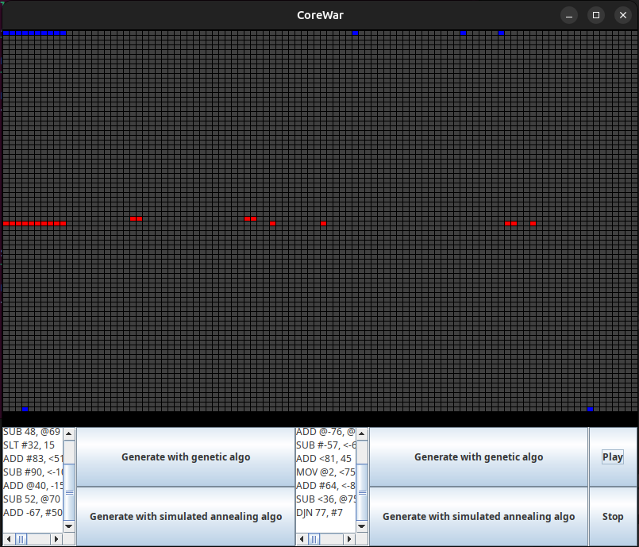

# ⚔️ CoreWar AI - MARS Engine & Evolutionary Algorithms


Welcome to our implementation of the famous **CoreWar** programming game, developed as part of our 2nd-year Computer Science degree project at the Université de Caen Normandie.

This project includes not only a complete virtual machine (MARS) to interpret the RedCode assembly language but also **two artificial intelligences (Genetic Algorithm and Simulated Annealing)** capable of writing and optimizing their own programs to win.



## 🧠 Main Features

* **Complete MARS Engine:** Strict execution of the RedCode standard (ICWS-88) with circular memory management handled by custom ALU and CU components.
* **MVC Architecture:** Clean separation of business logic and graphical user interface using the Observer Pattern.
* **Genetic Algorithm:** Evolution of a population of programs via roulette wheel selection, single-point crossover, and mutations. We reduced the computational complexity from $\Theta(P^2 \times G)$ to $\Theta(P \times G)$ by implementing a highly optimized tournament system.
* **Simulated Annealing:** Single-warrior optimization guided by thermodynamic probability ($P=e^{-\Delta/T}$) and evaluated against standard benchmark opponents (Bomber, Imp, Dwarf).

## 📄 Engineering & Architecture Report

To deeply understand our architectural choices (UML diagrams), the mathematics behind our AIs, and the detailed analysis of our experimental results, **[check out our comprehensive project report (PDF, in French)](rapprt/rapport_CoreWar.pdf)**.

## 🚀 How to Run the Project

This project uses **Apache Ant** for easy compilation and execution.

1. Clone this repository:
   ```bash
   git clone [https://github.com/GabDvck/corewar.git](https://github.com/GabDvck/corewar.git)
   cd corewar
   
2. Compile the project:
    ```bash
    ant compile
    
3. Launch the graphical interface:
    ```bash
    ant run

(Note: You can also run the unit tests using ant test or generate the technical documentation with ant javadoc).

## 👨‍💻 Team

- Gabriel Devick
- Galéo Prioux
- Nathan Giraud
